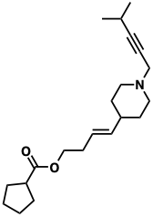

# Introduction {#introduction}

This is an introduction the the book overall.

## Organic chemistry in daily life

Here are some examples from petroleum to plastics to soaps. See Figure \@ref(fig:my-fig).

(\#fig:my-fig)An amazing plot

## Organic chemistry in medicine

Some examples from medicinal chemistry

:::: {.asidebox data-latex=""}
::: {.center data-latex=""}
**NOTICE!**
:::

Thank you for noticing this **new notice**! Your noticing it has
been noted, and _will be reported to the authorities_!
::::
